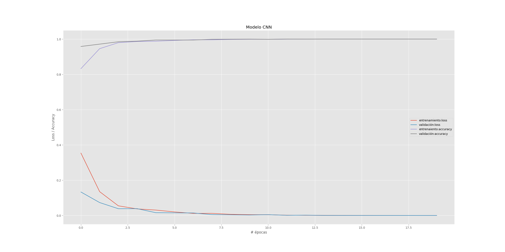

# Face Mask Detection
Detect face with and without a facemask. CNN model created build with TensorFlow and Keras, camera and face detection with OpenCV.

## Run
Requirements:
* python-opencv
* numpy
* tensorflow

```bash
python detector.py
```

## Results
The project includes a ready-to-use CNN Tensorflow model (`out/cnn.hdf5`) trained, tested and validated with [this](https://www.kaggle.com/ashishjangra27/face-mask-12k-images-dataset) dataset (not included here to save space).

#### CNN Model
Keras layers:
```python
Conv2D(32, kernel_size=(3,3), activation='relu', input_shape=(50,50,3))
Conv2D(64, kernel_size=(3,3), activation='relu')
MaxPooling2D( pool_size=(2,2) )

Flatten()
Dense(64, activation='relu')
Dense(20, activation='relu')
Dense(2, activation='softmax')
```
Optimizer: Gradient descent with 0.05 as learning rate (`tensorflow.keras.optimizers.SGD(lr=0.05)`)

#### Training:


Parameters:

* epochs: 10
* Image sizes: Resized to 50x50
* Training data: 10 000 images
* Test data: 10 000 images

#### Validation metrics
The model was validated with 10 000 images in the dataset and the metrics were obtained with `sklearn.metrics.classification_report`.

```
              precision    recall  f1-score   support

 WithoutMask       1.00      0.99      1.00       400
    WithMask       1.00      1.00      1.00       400

    accuracy                           1.00       800
   macro avg       1.00      1.00      1.00       800
weighted avg       1.00      1.00      1.00       800
```
